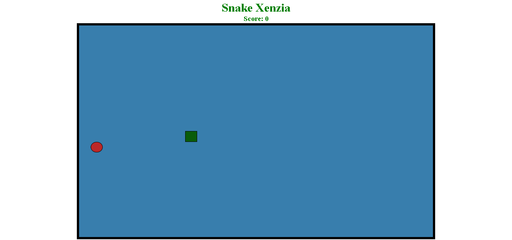

# 🐍 Snake Game JavaScript Project 🎮

Welcome to the Snake Game JavaScript project! This mini project serves as a practical exercise to enhance  JavaScript skills. The game features various functionalities and responsive behavior. Feel free to explore, modify, and learn from the code.
---

## Project Structure 📁

- `index.html`: The main HTML file that includes the game board and necessary elements.
- `snake.js`: Module containing logic for the snake, including movement, collision detection, and intersection.
- `grid.js`: Module providing utility functions for managing the game grid.
- `food.js`: Module handling the generation and rendering of food items.
- `style.css`: CSS file for styling the game board and elements.
- `script.js`: Main script file orchestrating the game loop and user interactions.

## Features 🚀

1. **Snake Movement**: The snake moves automatically in the specified direction.
2. **Food Generation**: Random food items appear on the grid for the snake to consume.
3. **Scoring**: Keep track of your score as you eat more food. The score increases by 2 for each food item consumed.
4. **Game Pause**: Press the spacebar to pause and resume the game. An alert notifies the player about the game state.
5. **Game Over**: The game ends if the snake collides with the game boundaries or itself. An alert is displayed, and the game can be restarted.

## Getting Started 🎮

1. Clone the repository: `git clone https://github.com/ayeshasikander/Sanke-Xenzia.git`
2. Open `index.html` in a web browser.
3. Use the arrow keys to control the snake's direction.
4. Press the spacebar to pause and resume the game.

## Additional Customization 🛠️

Feel free to explore and customize the code to add more features, improve styling, or enhance gameplay. Consider adding features such as:

- Increasing snake speed over time.
- Implementing levels with different grid sizes and complexities.
- Adding sound effects for actions like eating food or game over.

## Contributions 🤝

Contributions are welcome! If you find any issues or have ideas for improvements, feel free to create a pull request or open an issue.

## License 📜

This project is licensed under the MIT License - see the [LICENSE](LICENSE) file for details.

Enjoy playing and happy coding! 🐍🎮